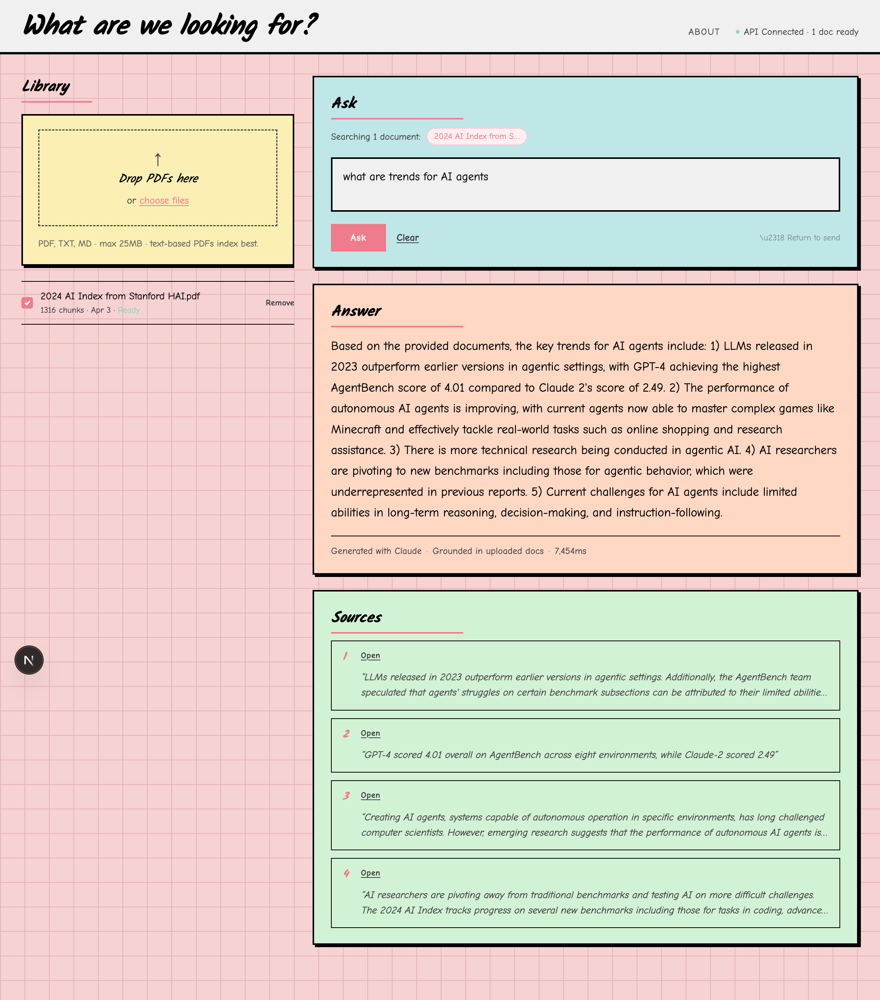
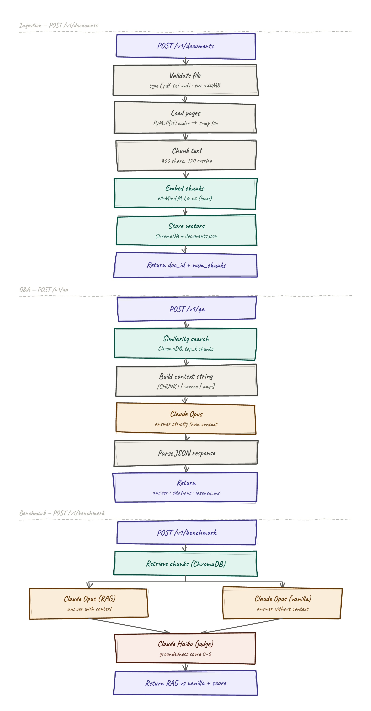

# SideNote

**Ask questions about your documents and get answers grounded in what they actually say.**

Upload a PDF, drop in a question, and SideNote finds the relevant passages, generates a clear answer, and shows you exactly which parts of the document it drew from — so you never have to wonder if the AI made something up.

---

## What it does

- **Upload documents** — drop in a PDF or text file and it's ready to query in seconds
- **Ask anything** — type a question in plain English and get a focused, accurate answer
- **See your sources** — every answer comes with cited excerpts so you can verify it yourself
- **Stay grounded** — answers are generated strictly from your documents, not the model's general knowledge

---

## How it works

When you upload a document, SideNote breaks it into chunks and indexes them. When you ask a question, it finds the most relevant chunks, hands them to Claude, and returns an answer with citations. A separate benchmarking mode runs the same question with and without document context, then scores how grounded each answer is — giving you a concrete measure of how much the RAG pipeline actually helps.

---

## Built with

- [Claude](https://www.anthropic.com) — for answering questions and grounding evaluation
- [ChromaDB](https://www.trychroma.com) — for vector search over document chunks
- [FastAPI](https://fastapi.tiangolo.com) — backend API
- [Next.js](https://nextjs.org) — frontend UI
