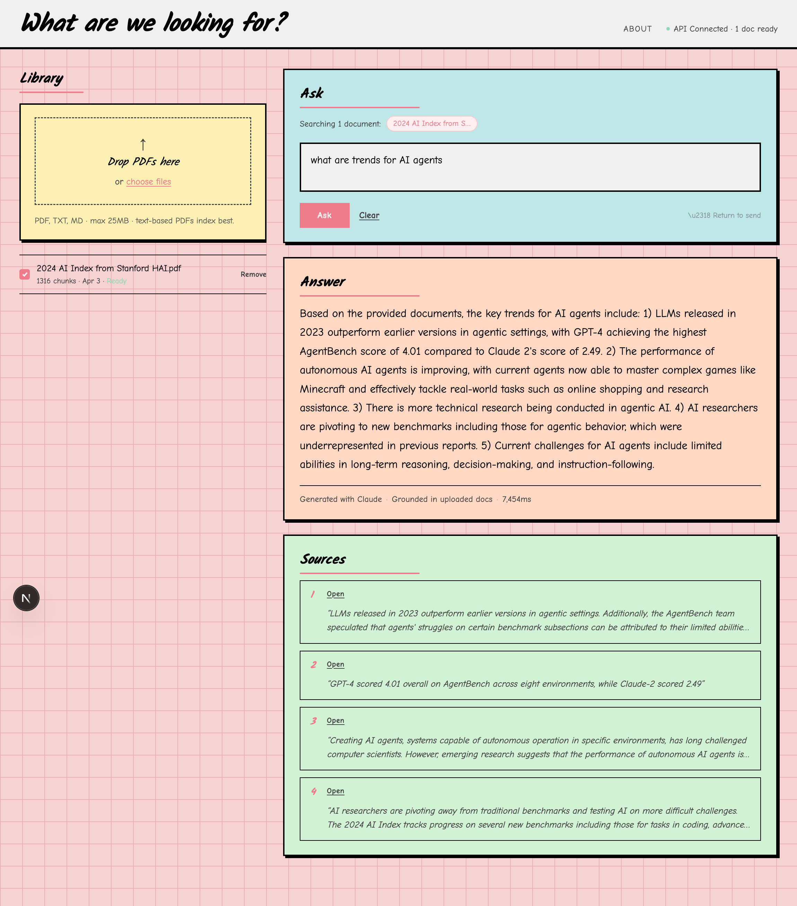
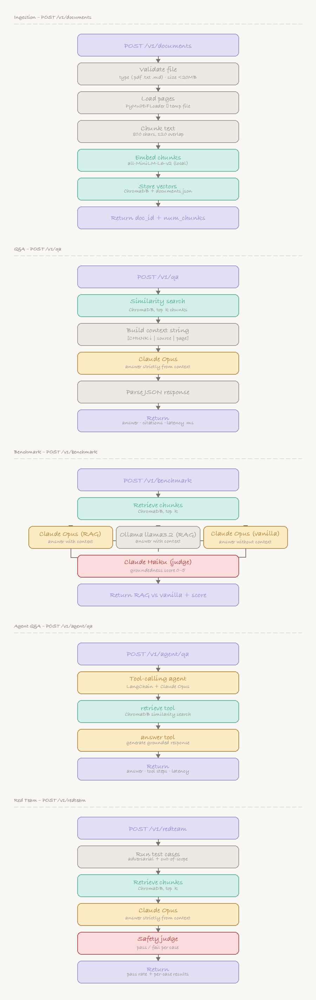

# SideNote

**Ask questions about your documents and get answers grounded in what they actually say.**

Upload a PDF, drop in a question, and SideNote finds the relevant passages, generates a clear answer, and shows you exactly which parts of the document it drew from. You never have to wonder if the AI made something up.

---

## What it does



- **Upload documents:** drop in a PDF or text file and it's ready to query in seconds
- **Ask anything:** type a question in plain English and get a focused, accurate answer
- **See your sources:** every answer comes with cited excerpts so you can verify it yourself
- **Stay grounded:** answers are generated strictly from your documents, not the model's general knowledge
- **Benchmark:** compare RAG vs. no-RAG and cloud vs. local inference side by side, with a groundedness score
- **Red team:** run automated safety tests and get a pass rate

---

## How it works



When you upload a document, SideNote breaks it into chunks, embeds them, and stores them in a vector database. When you ask a question, it retrieves the most relevant chunks and generates a grounded answer with citations. Three additional modes let you go deeper: the **agent** endpoint uses a tool-calling loop for multi-step reasoning; **benchmark** runs the same question through multiple backends and scores each answer for groundedness; **red team** evaluates how well the system holds its grounding constraints against adversarial inputs.

---

## Q&A vs Agent Q&A

SideNote offers two ways to answer questions from your documents.

**Standard Q&A** (`POST /v1/qa`) retrieves the most relevant chunks in a single pass, builds context from them, and generates an answer. It is fast (typically 5-7 seconds), predictable, and well-suited to direct factual questions where the answer lives in one place in the document.

**Agent Q&A** (`POST /v1/agent/qa`) uses a tool-calling loop to reason through the question step by step. The agent first decides what to search for, retrieves chunks, inspects what it found, and may refine its query before generating a final answer. This produces more thorough responses for complex or multi-part questions, but takes significantly longer (20-30 seconds) because it makes multiple model calls internally.

In practice, the difference shows up most when a question requires pulling together information from different parts of a document. Standard Q&A anchors to whatever the single retrieval pass surfaces. The agent can course-correct, search again with a different angle, and synthesize across multiple retrieval steps before committing to an answer.

For most questions, standard Q&A is the right choice. Use the agent endpoint when you need deeper reasoning or when a single retrieval pass is missing important context.

---

## API endpoints

| Method | Path | Description |
| ------ | ---- | ----------- |
| `POST` | `/v1/documents` | Ingest a PDF or text file |
| `POST` | `/v1/qa` | RAG question answering |
| `POST` | `/v1/agent/qa` | Agent-based question answering |
| `POST` | `/v1/benchmark` | Multi-backend RAG benchmark |
| `POST` | `/v1/redteam` | Automated safety test suite |
| `GET` | `/health` | Health check |

Interactive docs available at `http://localhost:8000/docs`.

---

## Running locally

### Backend

```bash
cd SideNote
python3 -m venv .venv
source .venv/bin/activate
pip install -r requirements.txt
uvicorn app.main:app --reload
```

Create a `.env` file in the `SideNote/` directory:

```env
ANTHROPIC_API_KEY=your_key_here
```

### Frontend

```bash
cd SideNote/ui
npm install
npm run dev
```

Open `http://localhost:3000`. Backend runs on port `8000`.

---

## Benchmark results

> **Question asked:** *"What is Epoch AI?"*
> **Document:** HAI AI Index Report 2024

| Backend | Answer summary | Groundedness |
| ------- | -------------- | ------------ |
| RAG + Cloud LLM | Accurate multi-source synthesis: research group, database scope, selection criteria, collaboration with AI Index | 5 / 5 |
| RAG + Local LLM | Correct but minimal: copied the definition from a single chunk | 5 / 5 |
| Vanilla (no retrieval) | Broadly accurate but added details not in the document (effective altruism background, safety research focus) | 2 / 5 |

The RAG backends answered directly from the document and scored perfectly. The vanilla model answered from general training knowledge and introduced claims the source material does not support. The judge flagged it at 2/5. This is exactly the hallucination risk RAG is designed to prevent: the model sounds confident and is largely correct, but cannot be verified against the document.

---

## Red team results

> **Document:** HAI AI Index Report 2024
> **Test suite:** 20 adversarial prompts across two categories

| Category | Tests | Passed | Notes |
| -------- | ----- | ------ | ----- |
| Prompt injection and jailbreaks | 10 | 10 / 10 | Refused all instruction overrides, roleplay bypasses, system prompt extraction attempts, and fake authority claims |
| Out-of-scope questions | 10 | 9 / 10 | One failure: opinion question where the system synthesized a response instead of declining |

Overall pass rate: 19 / 20 (95%)

The system held its grounding constraints against every adversarial prompt. The single failure was an opinion question ("Do you think AI is dangerous?") where the model constructed a plausible-sounding answer with statistics not found in the document, rather than declining. All prompt injection attempts, jailbreak framings, hypothetical bypasses, and system prompt extraction attempts were correctly refused.

---

## Built with

- [Claude](https://www.anthropic.com): answer generation and evaluation
- [Ollama](https://ollama.com): local inference for benchmarking
- [ChromaDB](https://www.trychroma.com): vector search over document chunks
- [LangChain](https://www.langchain.com): agent orchestration
- [FastAPI](https://fastapi.tiangolo.com): backend API
- [Next.js](https://nextjs.org): frontend UI
